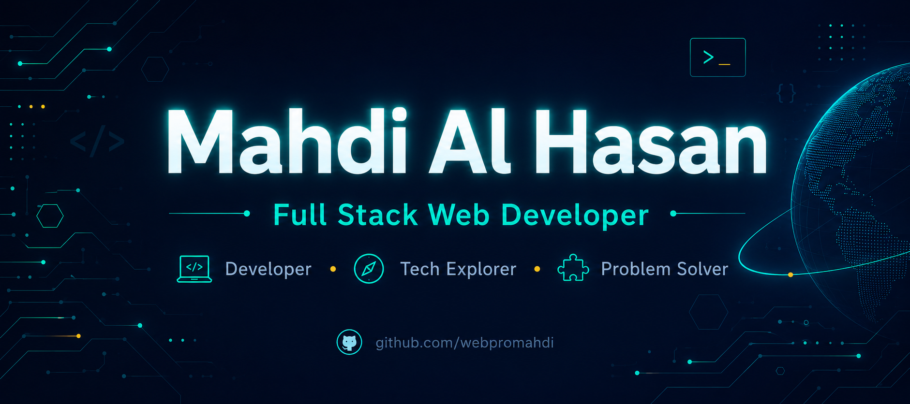

<div align="center">



<p>  <a href="https://webpromahdi.vercel.app/"></a>  <a href="mailto:webpro.mahdi@gmail.com"></a>
  <a href="https://linkedin.com/in/webpro-mahdi"></a>
  <a href="https://github.com/webpromahdi"></a>
  
</p>

</div>

<br>


### 👨‍💻 About Me

```typescript
class Developer {
  name: string = "Mahdi Al Hasan";
  role: string = "Full Stack Web Developer";
  
  focus: string = "Building full stack web applications 
                    with clean, scalable code";

  currentlyLearning = {
    tools: "Next.js"
  };

  openTo = {
    seeking: "Internships, jobs & freelance work"
  };

  strengths = {
    frontend: "React.js, Tailwind CSS, responsive UI",
    backend: "Node.js, Express.js, MongoDB",
    approach: "Problem-first, clean & maintainable code"
  };
}
```

<br clear="right"/>

---

<div align="center">

## 🛠️ Tech Stack

</div>

<table>
<tr>
<td width="33%" valign="top">

#### 🖥️ Frontend

 &nbsp; React  
 &nbsp; Next.js  
 &nbsp; TypeScript  
 &nbsp; JavaScript  
 &nbsp; Tailwind CSS  
 &nbsp; Bootstrap  

</td>
<td width="33%" valign="top">

#### ⚙️ Backend

 &nbsp; Node.js  
 &nbsp; Express.js  
 &nbsp; REST API  

</td>
<td width="33%" valign="top">

#### 🗄️ Database & ORM

 &nbsp; PostgreSQL  
 &nbsp; MongoDB  
 &nbsp; MySQL  
 &nbsp; Prisma  
 &nbsp; Mongoose  

</td>
</tr>
<tr>
<td width="33%" valign="top">

#### ☁️ Cloud & Backend Services

 &nbsp; Firebase  
 &nbsp; Supabase  
 &nbsp; Render  

</td>
<td width="33%" valign="top">

#### 💻 Languages

 &nbsp; C++  
 &nbsp; Python  
 &nbsp; SQL  

</td>
<td width="33%" valign="top">

#### 🔧 Tools

 &nbsp; Git  
 &nbsp; Docker  

</td>
</tr>
</table>

---

<div align="center">

## 📊 GitHub Statistics

<div align="center">


</div>


</div>

---

<div align="center">

## � Featured Projects


</div>

<table align="center">
<tr>
<td align="center" width="50%">

### �️ Bachelor Meal System

Full stack **MERN** application for managing  
shared meal expenses among roommates.  
Built with React, Node.js, Express & MongoDB.

**Role:** Solo Developer (Full Stack)

</td>
<td align="center" width="50%">

### 🩸 Blood Donation System

A team-built platform connecting blood  
donors with recipients efficiently.  
Built with HTML, CSS, JavaScript, PHP & MySQL.

**Role:** Frontend & Backend Integration

</td>
</tr>
<tr>
<td align="center" width="50%">

### 🚀 AI Career SaaS App

An AI-powered career platform leveraging OpenRouter & DeepSeek LLM.  
Features AI resume generation, tailored interview  
assistance, and ATS analysis to accelerate professional growth.

</td>
<td align="center" width="50%">

### � Recipe Alchemy Nourish

A recipe discovery and meal planning  
web application with an intuitive  
and modern user interface.

</td>
</tr>
</table>

---

<div align="center">

## � What I Bring

</div>

<table align="center">
<tr>
<td align="center" width="33%">

### 🎯 Problem Solver

I enjoy building practical  
solutions using the MERN stack  
to tackle real-world challenges.

</td>
<td align="center" width="33%">

### ⚛️ Frontend Focus

Creating responsive, accessible,  
and polished user interfaces  
with React & Tailwind CSS.

</td>
<td align="center" width="33%">

### 🧹 Clean Coder

Writing readable, maintainable  
code with clear structure  
and thoughtful design.

</td>
</tr>
</table>

---

<div align="center">

## 🌱 Currently Exploring

```yaml
learning:
  - Next.js & Server-Side Rendering
  - PostgreSQL for relational data
  - Advanced React patterns & hooks

approach:
  - Building hands-on projects
  - Learning through real implementations
  - Contributing to team-based projects
```

</div>

---

<div align="center">

## 🤝 Let's Connect


### Open to internships, job opportunities, freelance work, and collaboration on MERN stack projects!

<a href="mailto:webpro.mahdi@gmail.com">
  
</a>

<br><br>

[](https://github.com/webpromahdi)
[](https://linkedin.com/in/webpro-mahdi)

</div>

---

<div align="center">

<br>


**Thanks for visiting my profile! ⭐**

</div>


